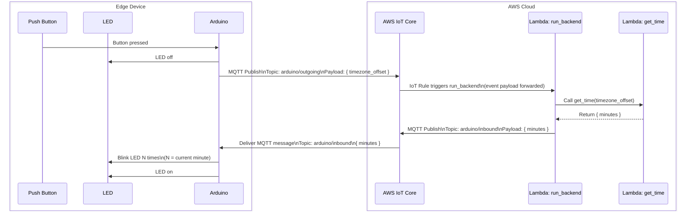
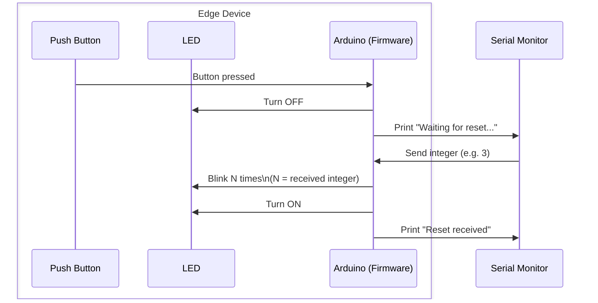
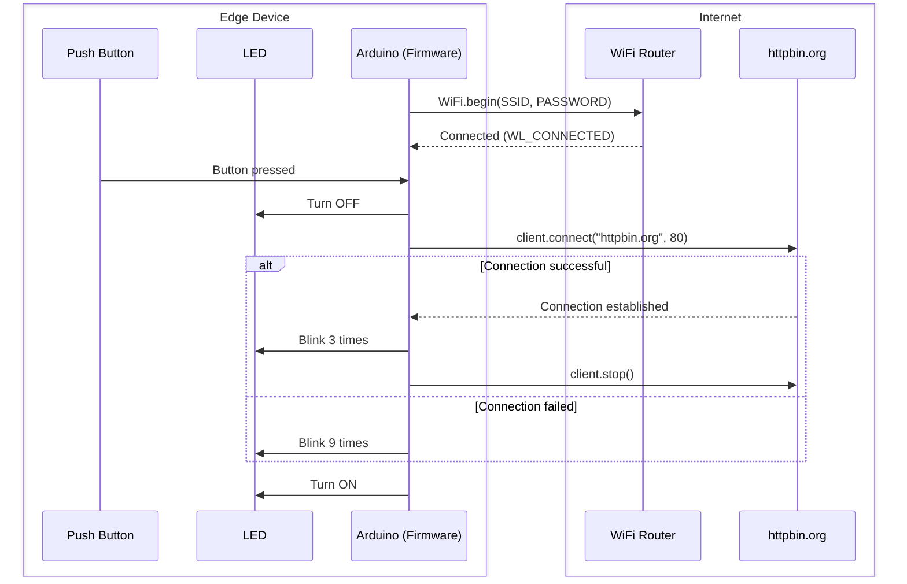
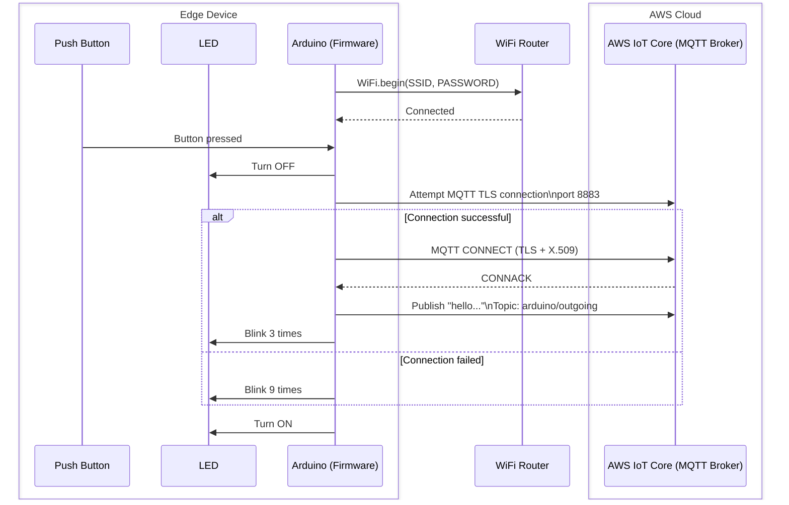

# iot-button-system

This tutorial walks you through building a small end-to-end IoT system: a physical button connected to an Arduino board that communicates with a cloud backend hosted on Amazon Web Services.

By the end, you will have a working IoT pipeline from a physical button press to cloud-side logic and back.



### Main Objectives - Build an End-to-End IoT Cloud System

* Build a complete system using an **Arduino**, MQTT, AWS IoT Core, and AWS Lambda.
* Publish and subscribe to MQTT topics (`arduino/outgoing`, `arduino/inbound`).
* Trigger a Lambda function from an IoT rule and process cloud-side logic.
* Send data back to the device and translate it into a physical action (LED blinking).
* Understand the full edge -> cloud -> edge communication loop.

### Secondary Objectives - Professional Engineering Practices

* Version the project using Git and GitHub.
* Develop embedded firmware using PlatformIO and Visual Studio Code instead of the Arduino IDE.
* Apply good security practices (secrets files, IAM users and roles, secure MQTT policies).
* Structure a multi-component system clearly.

## Structure of the tutorial

> [!WARNING]
> IoT systems mix hardware, firmware, networking, and cloud infrastructure. When something does not work, the issue could be anywhere. If you connect everything at once, debugging quickly becomes painful.

Thus, this tutorial follows a strict order:

1. Make the hardware work.
2. Make the device talk to your computer.
3. Make it connect to the Internet.
4. Make it talk to AWS.
5. Add backend logic in the cloud.


Take the tasks in order. Do not move on until the current step behaves exactly as expected. That discipline is what makes larger systems manageable.

### 🔧Task 1 - Building and Testing the edge device

Button, LED, firmware logic, and a simple serial handshake. No Internet, no cloud.

*👉 Click [here](https://github.com/David-GERARD/iot-button-system/blob/main/docs/TASK_1.md) to read the instructions for task 1.*

### 📶Task 2 - Connecting the edge device to the internet

The device connects to WiFi and performs a basic external request. We confirm networking works before touching AWS.

*👉 Click [here](https://github.com/David-GERARD/iot-button-system/blob/main/docs/TASK_2.md) to read the instructions for task 2.*

### ☁️Task 3 - Connecting the edge device to AWS IOT Core

Secure MQTT communication with the cloud. We verify the device can connect and exchange messages.

*👉 Click [here](https://github.com/David-GERARD/iot-button-system/blob/main/docs/TASK_3.md) to read the instructions for task 3.*

### 🧠Task 4 - Create a system backend using AWS Lambda triggered by AWS IoT Core

AWS IoT rules and Lambda functions complete the end-to-end system.

*👉 Click [here](https://github.com/David-GERARD/iot-button-system/blob/main/docs/TASK_4.md) to read the instructions for task 4.*

## Repository structure
```bash
iot-button-system/
|---docs/ # Contains the step by step instructions for this tutorial
|---firmware/ # Contains Arduino code for the MKR WIFI 10101 board
|---infra/ # Contains AWS IOT config files
|---lambdas/ # Contains AWS Lambda function code written in python
```

## Hardware Requirements
- Arduino MKR WIFI 10101.
- LED kit.
- Push button kit.
