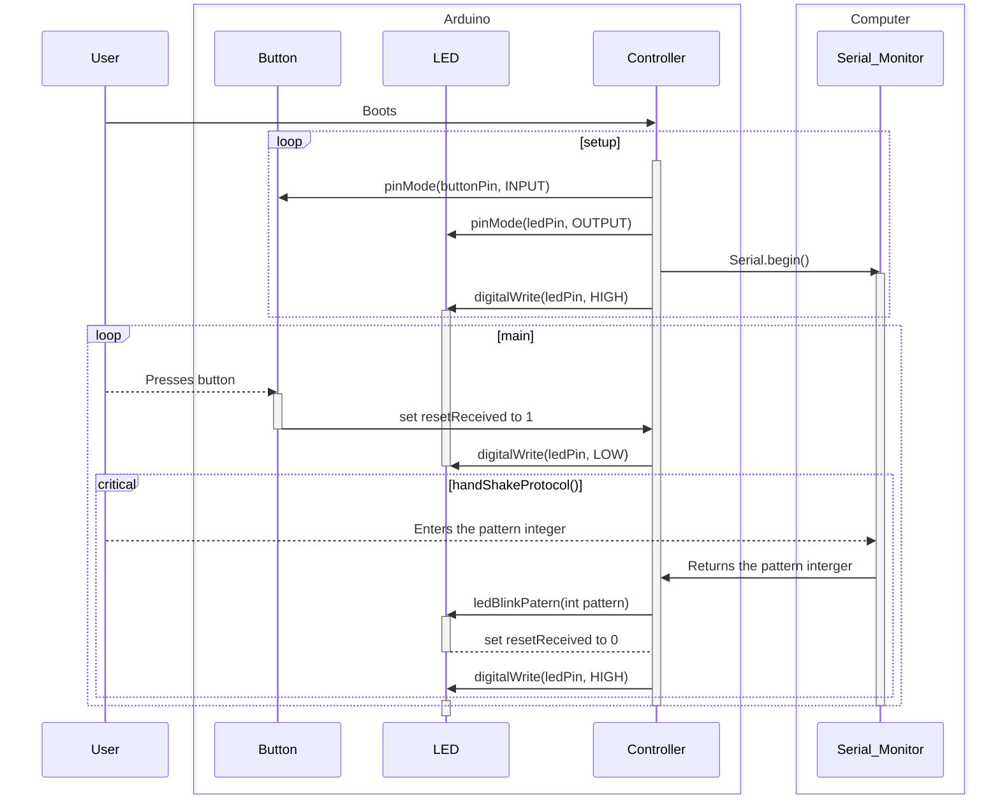

# TASK 1 - Building and Testing the edge device


## 1.0 Setting up

### 1.0.1 - Setting up your IDE
> [!NOTE]  
> In this tutorial, we use the PlatformIO extension of VSCode to compile code and upload it to the Arduino. You can also use the Arduino IDE, but you will have to troubleshoot issues on your own.

> [!CAUTION]
> If you're using the [Windows Subsystem for Linux (WSL)](https://learn.microsoft.com/en-us/windows/wsl/), things might be less straightforward. You can try this (unverified by us) [tutorial](https://developer.mamezou-tech.com/en/blogs/2025/04/10/develop-on-vscode-platformio-and-wsl/), and please let us know in an [issue](https://github.com/David-GERARD/iot-button-system/issues) if it worked.

1. Download and install [VSCode](https://code.visualstudio.com/).
2. In VSCode, open the Extensions tab (in the left toolbar), search and install the [PlatformIO IDE extension](https://marketplace.visualstudio.com/items?itemName=platformio.platformio-ide).
3. Restart VSCode.

### 1.0.2 - Forking and Cloning the project onto your computer
> [!NOTE]
> This section requires minimal experience with git and GitHub. If you're not familiar with these VERY important software development tools, please check the following links before proceeding with this section.
> - [25 Basic Linux Commands](https://www.geeksforgeeks.org/linux-unix/basic-linux-commands/).
> - [Git and GitHub Introduction](https://www.w3schools.com/git/git_intro.asp?remote=github).
> - [Creating an account on GitHub](https://docs.github.com/en/get-started/start-your-journey/creating-an-account-on-github).
> - [Git Config](https://www.w3schools.com/git/git_config.asp?remote=github) (set your email as the one you used for your GitHub account).
> - [Fork a repository](https://docs.github.com/en/pull-requests/collaborating-with-pull-requests/working-with-forks/fork-a-repo).
> - [Cloning a repository](https://docs.github.com/en/repositories/creating-and-managing-repositories/cloning-a-repository).


1. Navigate [project's GitHub repository home page](https://github.com/David-GERARD/iot-button-system).
2. [Optional] if you find this tutorial useful, click on the Star button in the top right corner (much appreciated).
3. Click on the Fork button in the top right corner.
4. In `Choose an owner`, choose your personal GitHub account, leave `Copy the main branch only` ticked, and click on Create fork.
5. In **your fork**, click on `Code`->`HTTPS`, and copy the URL.
> [!IMPORTANT]
> Make sure the URL is `https://github.com/<your_username>/iot-button-system` and NOT `https://github.com/David-GERARD/iot-button-system`.
6. In VSCode, open a terminal (I would recommend using a unix-style terminal such as bash, Git bash if you are on windows, zsh...), and navigate to where you want to store the project, and [clone the repository](https://docs.github.com/en/repositories/creating-and-managing-repositories/cloning-a-repository). 

If you want to see the entire project in VSCode, click on `File`->`Open folder...` and select the cloned folder. It contains both the PlatformIO project with the Arduino Firmware (in `firmware/`), config files for AWS IOT Core (in `infra/`), and AWS Lambda functions coded in python (in `lambdas/`).


### 1.0.3 - Open the Arduino firmware in PlatformIO

1. In VSCode, click on the PlatformIO tab (in the left toolbar). 
2. In `project tasks`, click on `Pick a Folder` (you might need to scroll down). navigate to the cloned repository, and inside it, select the folder `firmware/`.

## 1.1 - Building the Edge Device

1. Connect the Arduino MKR WIFI 10101 to the MKR Connector Carrier.
2. Connect the LED module to port D3 of the MKR Connector Carrier.
3. Connect the Push Button module to the port D2 of the MKR Connector Carrier.

> [!WARNING]
> Make sure to correctly orient the connectors.
> 

## 1.2 - Write and upload the firmware to the edge device

Event logic implemented in task 1:


> [!TIP]
> Accordin to the Oxford English Dictionary, **firmware** is defined as *A permanent form of software built into certain kinds of computer*. In practice, this is what we call the code that program [microcontrollers](https://en.wikipedia.org/wiki/Microcontroller) or [microprocessors](https://en.wikipedia.org/wiki/Microprocessor).

1. In VScode, click on the Explorer tab, and double click on the file `firmware/src/main.cpp` to open it.
2. Read the code, and familiarise yourself with how it implements the event logic illustrated at the top of this document.
3. In `main.cpp`, implement the function `handShakeProtocol()` so that when triggered:
    - It waits for an integer from the Serial monitor.
    - When received, it runs the function `ledBlinkPatern` using the integer as its argument.
    - When `ledBlinkPatern` is done running, it sets `resetReceived` to 0 and it turns the LED back on.
4. In the PlateformIO tab, in `general`, click on `Build`. Check the temrinal the Arduino into your computer.
5. In the PlateformIO tab, in `general`, click on `Upload and Monitor`. 

## 1.3 - Test the edge device
Verify the following:
1. By default, the LED is on.
2. When pressing the button, the LED turns off and stays off.
3. When entering an integer in the serial monitor, the LED blinks (3 times if you entered 3...), and then turns back on.

## Solutions for task 1

`firmware/src/main.cpp`:
```c++
#include <Arduino.h>


// Pin definitions
const int buttonPin = 2;     // the number of the pushbutton pin
const int ledPin =  3;      // the number of the LED pin

// Status variables
int buttonState = 0;         // variable for reading the pushbutton status
int resetReceived = 0;       // variable for reading the reset status


// Function prototypes
void ledBlinkPatern(int pattern);
void handShakeProtocol();


// The setup function runs once when you press reset or power the board
void setup() {
    // initialize serial communication.
    Serial.begin(9600);
    // initialize the LED pin as an output.
    pinMode(ledPin, OUTPUT);
    // initialize the pushbutton pin as an input.
    pinMode(buttonPin, INPUT);
    // make sure the LED is on at the start
    digitalWrite(ledPin, HIGH); 

}

// The loop function runs over and over again forever
void loop() {

    buttonState = digitalRead(buttonPin);

    if (buttonState == HIGH && resetReceived == 0) {
        Serial.println("Button pressed, waiting for reset...");
        resetReceived = 1;
        digitalWrite(ledPin, LOW);
    }

    if (resetReceived == 1) {
        handShakeProtocol();
        delay(1000); // Add a delay to prevent the loop from running too fast after the handshake protocol is complete
    }


}


void ledBlinkPatern(int pattern) {
    /*************************************************************
    * This function is used to show the status of the LED. 
    * 
    * The pattern indicates how many times the LED will blink. 
    * For example, if the pattern is 3, the LED will blink 3 times.
    **************************************************************/
    Serial.print("Status received:");
    Serial.println(pattern);
    for (int i = 0; i < pattern; i++) {
        digitalWrite(ledPin, HIGH);
        delay(500);
        digitalWrite(ledPin, LOW);
        delay(500);
    }
}

void handShakeProtocol() {
    /*************************************************************
    * This function is used to implement the handshake protocol between pressing the button and the reset of the LED. 
    * 
    * When the button is pressed, the LED will turn on and stay on until the reset is received. 
    * Once the reset is received, the LED will turn off and the system will be ready for the next button press.
    * In task 1, the reset is triggered by waiting for an integer pattern to be sent through the serial monitor.
    * In task 2, the reset is triggered by connecting to an external server to check that the device is connected to the internet.
    * In task 3, the reset is triggered by waiting for an MQTT message that aknowledges that the device is connected to the MQTT broker.
    * In task 4, the reset is triggered by waiting for an MQTT message that sends a specific command to the device based on administrative rules defined in the cloud.
    **************************************************************/

    // TODO: YOUR CODE HERE
    if (Serial.available() > 0) {
        int pattern = Serial.parseInt(); // read the pattern from the serial monitor
        ledBlinkPatern(pattern); // blink the LED according to the received pattern

        resetReceived = 0; // reset the reset status
        digitalWrite(ledPin, HIGH);
        Serial.println("Reset received, LED is ON, waiting for button press...");
    }
}
```
