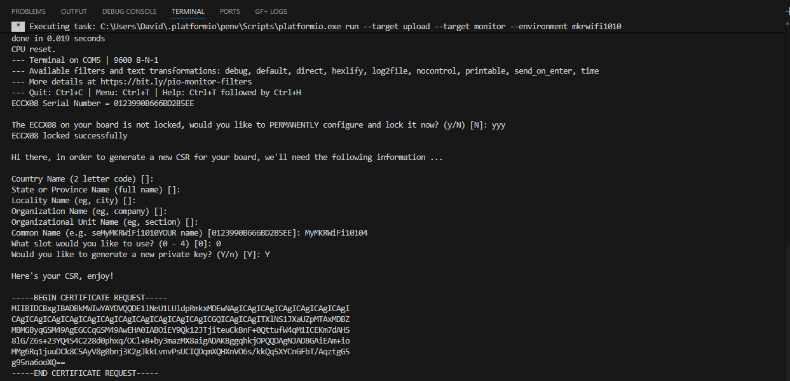
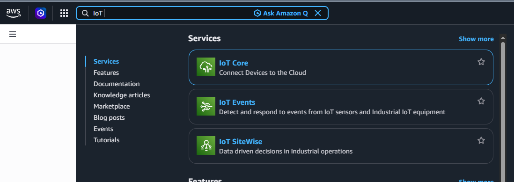
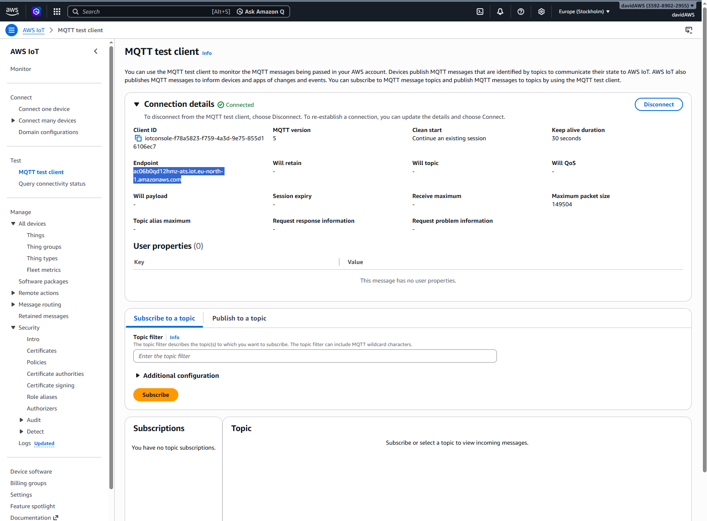

# Task 3 - Connecting the edge device to AWS IOT Core

## 3.0 - Setup the AWS account

> [!IMPORTANT]
> The free tier of AWS lasts 6 months, and an email address can only be used once to create an AWS account. If you have an AWS account but the free tier expired, create a new one using a different address (you can create a free gmail account if need be).

> [!TIP]
> If you're working in a group, it is best to use a single account, and have its owner [create IAM users](https://docs.aws.amazon.com/IAM/latest/UserGuide/id_users_create.html) for each team members. Make sure to grant these IAM users the right permissions to permorm their required tasks.

If need be, [create a new AWS account](https://docs.aws.amazon.com/iot/latest/developerguide/setting-up.html) and IAM users for each team members (and yourself, it is good practice to only use the root access for permission management).


## 3.1 - Configure connectivity to AWS IoT Core 

### 3.1.1 - Create a CSR for a private key generated in an ECC508/ECC608 crypto chip slot

AWS IoT Core requires devices that connect using the MQTT protocol to use X.509 certificates for authentication. We'll use a sketch to generate a Certificate Signing Request (CSR) on the board and then upload this CSR in the AWS console to create an X.509 certificate.

1. Create a copy of `firmware/src/main.cpp` (such as `firmware/backup/main.cpp`).
    > [!CAUTION]
    > Do NOT store the copy in `firmware/src/`.
2. In `firmware/platformio.ini`, make sure that the following are added to the [list of dependencies](https://docs.platformio.org/en/latest/librarymanager/dependencies.html#declaring-dependencies).
    - `ArduinoECCX08`
3. Replace the code in `firmware/src/main.cpp` with the code from [this GitHub Repository](https://github.com/arduino-libraries/ArduinoECCX08/blob/master/examples/Tools/ECCX08CSR/ECCX08CSR.ino). 
    > [!WARNING]
    > Don't upload the code to the Arduino yet!

4. In the platformIO extension, click on `Build`. There should be an error message (there is a bug in the code which prevents compilation). Try and fix it so that `Build` doesn't return an error. If you can't, use the solution at the end of this document.
    > [!TIP]
    > Look into [function declaration VS definition](https://www.w3schools.com/cpp/cpp_functions.asp) in C++.

5.  Using the `Upload and Monitor` of the PatformIO extension, upload the code to the Arduino. the Serial Monitor will prompt you for information to include in the CSR. Most entries can be left blank and except:    
    - The "Common Name", which you can put as `MyMKRWiFi1010`.
    - The slot number, try using `0`, if not available try `1`, `2`...
    > [!CAUTION]
    > This locking process is permanent and irreversible, but is needed to use the the crypto element - the configuration the sketch sets allows to use 5 private key slots with any Cloud provider (or server) and a CSR can be regenerated any time for each of the other four slots.

    

5. Copy the generated CSR text including "-----BEGIN CERTIFICATE REQUEST-----" and "-----END CERTIFICATE REQUEST-----". and save it to a new `csr.txt` file.
    > [!CAUTION]
    > Make sure to **save this file**, but do not upload it to GitHub (it is bad practice, we use secrets instead).


### 3.1.2 - Create a thing in AWS IoT

1. Log into your AWS account, and using the searchbar, open AWS IoT Core.
    
2. In the left menu bar, click on `Manage` -> `All devices` -> `Things`.
3. Click on `Create things`, choose `create single thing`, choose a name for your thing (such as `MyMKRWiFi1010`), leave all other fields as default, and click on next.
4. Select `Upload CSR`, and upload the `csr.txt` file you created.
5. Click on `Create policy` (it opens a new tab), name it ` FirstPolicy`, then click on `JSON`, and paste the content of `infra/policies/first_policy.json`. Click on `Create`.
6. Going back to the Thing tab, you should now see your policy in the list of policies. Tick the box to select it, and click on `Create thing`.
7. In the left menu bar, click on `Manage` -> `Security` -> `Certificates`. Click on the certificate you created, then click on:
    - `Actions`->`Activate`
    - `Actions`->`Download` (save this file)
8. In the left menu bar, click on `Test`->`MQTT test client`. Click on the dropdown menu `Connection details`, and copy the AWS IoT broker Endpoint URL.
    


## 3.2 - Update the firware of the edge device to test connectivity to AWS IoT Core

1. In the file `firmware/include/secrets.h` you created in task 2, paste the following:
    ```cpp
    // Fill in the url of your AWS IoT broker copied in task 3.1.2.8
    #define SECRET_BROKER "xxxxxxxxxxxxxx.iot.xx-xxxx-x.amazonaws.com"
    ```
    ```cpp
    // Fill in with the content of the file downloaded from AWS in 3.1.2.7
    const char SECRET_CERTIFICATE[] = R"(
    -----BEGIN CERTIFICATE-----
    xxxxxxxxxxxxxxxxxxxxxxxxxxxxxxxxxxxxxxxxxxxxxxxxxxxxxxxxxxxxxxxx
    xxxxxxxxxxxxxxxxxxxxxxxxxxxxxxxxxxxxxxxxxxxxxxxxxxxxxxxxxxxxxxxx
    xxxxxxxxxxxxxxxxxxxxxxxxxxxxxxxxxxxxxxxxxxxxxxxxxxxxxxxxxxxxxxxx
    xxxxxxxxxxxxxxxxxxxxxxxxxxxxxxxxxxxxxxxxxxxxxxxxxxxxxxxxxxxxxxxx
    xxxxxxxxxxxxxxxxxxxxxxxxxxxxxxxxxxxxxxxxxxxxxxxxxxxxxxxxxxxxxxxx
    xxxxxxxxxxxxxxxxxxxxxxxxxxxxxxxxxxxxxxxxxxxxxxxxxxxxxxxxxxxxxxxx
    xxxxxxxxxxxxxxxxxxxxxxxxxxxxxxxxxxxxxxxxxxxxxxxxxxxxxxxxxxxxxxxx
    xxxxxxxxxxxxxxxxxxxxxxxxxxxxxxxxxxxxxxxxxxxxxxxxxxxxxxxxxxxxxxxx
    xxxxxxxxxxxxxxxxxxxxxxxxxxxxxxxxxxxxxxxxxxxxxxxxxxxxxxxxxxxxxxxx
    xxxxxxxxxxxxxxxxxxxxxxxxxxxxxxxxxxxxxxxxxxxxxxxxxxxxxxxxxxxxxxxx
    xxxxxxxxxxxxxxxxxxxxxxxxxxxxxxxxxxxxxxxxxxxxxxxxxxxxxxxxxxxxxxxx
    xxxxxxxxxxxxxxxxxxxxxxxxxxxxxxxxxxxxxxxxxxxxxxxxxxxxxxxxxxxxxxxx
    xxxxxxxxxxxxxxxxxxxxxxxxxxxxxxxxxxxxxxxxxxxxxxxxxxxxxxxxxxxxxxxx
    xxxxxxxxxxxxxxxxxxxxxxxxxxxxxxxxxxxxxxxxxxxxxxxxxxxxxxxxxxxxxxxx
    xxxxxxxxxxxxxxxxxxxxxxxxxxxxxxxxxxxxxxxxxxxxxxxxxxxxxxxxxxxxxxxx
    xxxxxxxxxxx=
    -----END CERTIFICATE-----
    )";
    ```
    > [!WARNING]
    > Make sure to leave no identation or empty lines in the certificate, it would prevent successful authentification and connection to the broker.
2. Replace the content of `firmware/src/main.cpp` (which contains the CSR generation script) with the copy you made earlier (containing the Arduino code for your edge device).
3. In `firmware/platformio.ini`, make sure that the following are added to the [list of dependencies](https://docs.platformio.org/en/latest/librarymanager/dependencies.html#declaring-dependencies).
    - `ArduinoMqttClient`
    - `ArduinoBearSSL`
4. Using this [example](https://docs.arduino.cc/tutorials/mkr-wifi-1010/securely-connecting-an-arduino-mkr-wifi-1010-to-aws-iot-core/#complete-sketch), modify the edge device firmware so that when the button is pressed, if the Arduino successfully connects to the MQTT broker, it sends a message on the topic `arduino/outgoin`, and makes the LED blink 3 times. Make the LED blink 9 times if the connection is unsuccessful.
5. In AWS IoT core, in the left menu bar, click on `Test`->`MQTT test client`. Subsrcibe to the topic `arduino/outgoing`.
6. Using the platformIO extension, build the code to check for error, and upload to the edge device with update and monitor. Veryfy that:
    - The LED behaves as expected and blinks 3 times to indicate successfull connection.
    - You see a message appear in the MQTT test client every time you press the button.


## Solutions for task 3
`firmware/platformio.ini`
```ini
; PlatformIO Project Configuration File
;
;   Build options: build flags, source filter
;   Upload options: custom upload port, speed and extra flags
;   Library options: dependencies, extra library storages
;   Advanced options: extra scripting
;
; Please visit documentation for the other options and examples
; https://docs.platformio.org/page/projectconf.html

[env:mkrwifi1010]
platform = atmelsam
board = mkrwifi1010
framework = arduino
monitor_speed = 9600
lib_deps = 
    WiFiNINA
    ArduinoECCX08
    ArduinoMqttClient
    ArduinoBearSSL

```

`firmware/src/main.cpp` (CSR generation script with fix)
```cpp
/*
ArduinoECCX08 - CSR (Certificate Signing Request)

This sketch can be used to generate a CSR for a private key
generated in an ECC508/ECC608 crypto chip slot.

If the ECC508/ECC608 is not configured and locked it prompts
the user to configure and lock the chip with a default TLS
configuration.

The user is prompted for the following information that is contained
in the generated CSR:
- country
- state or province
- locality
- organization
- organizational unit
- common name

The user can also select a slot number to use for the private key
A new private key can also be generated in this slot.

The circuit:
- Arduino MKR board equipped with ECC508 or ECC608 chip

This example code is in the public domain.
*/

#include <ArduinoECCX08.h>
#include <utility/ECCX08CSR.h>
#include <utility/ECCX08DefaultTLSConfig.h>

String promptAndReadLine(const char* prompt, const char* defaultValue);
String readLine();

void setup() {
Serial.begin(9600);
while (!Serial);

if (!ECCX08.begin()) {
    Serial.println("No ECCX08 present!");
    while (1);
}

String serialNumber = ECCX08.serialNumber();

Serial.print("ECCX08 Serial Number = ");
Serial.println(serialNumber);
Serial.println();

if (!ECCX08.locked()) {
    String lock = promptAndReadLine("The ECCX08 on your board is not locked, would you like to PERMANENTLY configure and lock it now? (y/N)", "N");
    lock.toLowerCase();

    if (!lock.startsWith("y")) {
    Serial.println("Unfortunately you can't proceed without locking it :(");
    while (1);
    }

    if (!ECCX08.writeConfiguration(ECCX08_DEFAULT_TLS_CONFIG)) {
    Serial.println("Writing ECCX08 configuration failed!");
    while (1);
    }

    if (!ECCX08.lock()) {
    Serial.println("Locking ECCX08 configuration failed!");
    while (1);
    }

    Serial.println("ECCX08 locked successfully");
    Serial.println();
}

Serial.println("Hi there, in order to generate a new CSR for your board, we'll need the following information ...");
Serial.println();

String country            = promptAndReadLine("Country Name (2 letter code)", "");
String stateOrProvince    = promptAndReadLine("State or Province Name (full name)", "");
String locality           = promptAndReadLine("Locality Name (eg, city)", "");
String organization       = promptAndReadLine("Organization Name (eg, company)", "");
String organizationalUnit = promptAndReadLine("Organizational Unit Name (eg, section)", "");
String common             = promptAndReadLine("Common Name (e.g. server FQDN or YOUR name)", serialNumber.c_str());
String slot               = promptAndReadLine("What slot would you like to use? (0 - 4)", "0");
String generateNewKey     = promptAndReadLine("Would you like to generate a new private key? (Y/n)", "Y");

Serial.println();

generateNewKey.toLowerCase();

if (!ECCX08CSR.begin(slot.toInt(), generateNewKey.startsWith("y"))) {
    Serial.println("Error starting CSR generation!");
    while (1);
}

ECCX08CSR.setCountryName(country);
ECCX08CSR.setStateProvinceName(stateOrProvince);
ECCX08CSR.setLocalityName(locality);
ECCX08CSR.setOrganizationName(organization);
ECCX08CSR.setOrganizationalUnitName(organizationalUnit);
ECCX08CSR.setCommonName(common);

String csr = ECCX08CSR.end();

if (!csr) {
    Serial.println("Error generating CSR!");
    while (1);
}

Serial.println("Here's your CSR, enjoy!");
Serial.println();
Serial.println(csr);
}

void loop() {
// do nothing
}

String promptAndReadLine(const char* prompt, const char* defaultValue) {
Serial.print(prompt);
Serial.print(" [");
Serial.print(defaultValue);
Serial.print("]: ");

String s = readLine();

if (s.length() == 0) {
    s = defaultValue;
}

Serial.println(s);

return s;
}

String readLine() {
String line;

while (1) {
    if (Serial.available()) {
    char c = Serial.read();

    if (c == '\r') {
        // ignore
        continue;
    } else if (c == '\n') {
        break;
    }

    line += c;
    }
}

return line;
}
```

`firmware/include/secrets.h`
```cpp
#define WIFI_SSID "xxxxxx"
#define WIFI_PASSWORD "xxxxx"

// Fill in the url of your AWS IoT broker copied in task 3.1.2.8
#define SECRET_BROKER "xxxx.iot.xx-xxxx-x.amazonaws.com"

const char SECRET_CERTIFICATE[] = R"(
-----BEGIN CERTIFICATE-----
xxxxxxxxxxxxxxxxxxxxxxxxxxxxxxxxxxxxxxxxxxxxxxxxxxxxxxxxxxxxxxxx
xxxxxxxxxxxxxxxxxxxxxxxxxxxxxxxxxxxxxxxxxxxxxxxxxxxxxxxxxxxxxxxx
xxxxxxxxxxxxxxxxxxxxxxxxxxxxxxxxxxxxxxxxxxxxxxxxxxxxxxxxxxxxxxxx
xxxxxxxxxxxxxxxxxxxxxxxxxxxxxxxxxxxxxxxxxxxxxxxxxxxxxxxxxxxxxxxx
xxxxxxxxxxxxxxxxxxxxxxxxxxxxxxxxxxxxxxxxxxxxxxxxxxxxxxxxxxxxxxxx
xxxxxxxxxxxxxxxxxxxxxxxxxxxxxxxxxxxxxxxxxxxxxxxxxxxxxxxxxxxxxxxx
xxxxxxxxxxxxxxxxxxxxxxxxxxxxxxxxxxxxxxxxxxxxxxxxxxxxxxxxxxxxxxxx
xxxxxxxxxxxxxxxxxxxxxxxxxxxxxxxxxxxxxxxxxxxxxxxxxxxxxxxxxxxxxxxx
xxxxxxxxxxxxxxxxxxxxxxxxxxxxxxxxxxxxxxxxxxxxxxxxxxxxxxxxxxxxxxxx
xxxxxxxxxxxxxxxxxxxxxxxxxxxxxxxxxxxxxxxxxxxxxxxxxxxxxxxxxxxxxxxx
xxxxxxxxxxxxxxxxxxxxxxxxxxxxxxxxxxxxxxxxxxxxxxxxxxxxxxxxxxxxxxxx
xxxxxxxxxxxxxxxxxxxxxxxxxxxxxxxxxxxxxxxxxxxxxxxxxxxxxxxxxxxxxxxx
xxxxxxxxxxxxxxxxxxxxxxxxxxxxxxxxxxxxxxxxxxxxxxxxxxxxxxxxxxxxxxxx
xxxxxxxxxxxxxxxxxxxxxxxxxxxxxxxxxxxxxxxxxxxxxxxxxxxxxxxxxxxxxxxx
xxxxxxxxxxxxxxxxxxxxxxxxxxxxxxxxxxxxxxxxxxxxxxxxxxxxxxxxxxxxxxxx
xxxxxxxxxxx=
-----END CERTIFICATE-----
)";
```

`firmware/src/main.cpp` (edge device code in task 3)
```cpp
#include <Arduino.h>
#include <WiFiNINA.h>
#include "secrets.h"
#include <ArduinoBearSSL.h>
#include <ArduinoECCX08.h>
#include <ArduinoMqttClient.h>

/////// Enter your sensitive data in arduino_secrets.h
const char ssid[]        = WIFI_SSID;
const char pass[]        = WIFI_PASSWORD;
const char broker[]      = SECRET_BROKER;
const char* certificate  = SECRET_CERTIFICATE;

WiFiClient client;
BearSSLClient sslClient(client); // Used for SSL/TLS connection, integrates with ECC508
MqttClient    mqttClient(sslClient);

unsigned long lastMillis = 0;

// Pin definitions
const int buttonPin = 2;     // the number of the pushbutton pin
const int ledPin =  3;      // the number of the LED pin

// Status variables
int buttonState = 0;         // variable for reading the pushbutton status
int resetReceived = 0;       // variable for reading the reset status


// Function prototypes
void ledBlinkPatern(int pattern);
void handShakeProtocol();
unsigned long getTime();
void onMessageReceived(int messageSize) ;
void publishMessage();


// The setup function runs once when you press reset or power the board
void setup() {
    // initialize serial communication.
    Serial.begin(9600);
    // initialize the LED pin as an output.
    pinMode(ledPin, OUTPUT);
    // initialize the pushbutton pin as an input.
    pinMode(buttonPin, INPUT);
    // make sure the LED is on at the start
    digitalWrite(ledPin, HIGH); 
    
    delay(5000); // Wait for 5 second to ensure the LED is on before connecting to WiFi
    Serial.println("Connecting to WiFi...");
    WiFi.begin(WIFI_SSID, WIFI_PASSWORD);
    while (WiFi.status() != WL_CONNECTED) {
    delay(500);
    Serial.print(".");
    }
    Serial.println("WiFi connected");

    if (!ECCX08.begin()) {
      Serial.println("No ECCX08 present!");
      while (1);
    }

    // Set a callback to get the current time
    // used to validate the servers certificate
    ArduinoBearSSL.onGetTime(getTime);

    // Set the ECCX08 slot to use for the private key
    // and the accompanying public certificate for it
    sslClient.setEccSlot(0, certificate);

    // Optional, set the client id used for MQTT,
    // each device that is connected to the broker
    // must have a unique client id. The MQTTClient will generate
    // a client id for you based on the millis() value if not set
    //
    // mqttClient.setId("clientId");

    // Set the message callback, this function is
    // called when the MQTTClient receives a message
    mqttClient.onMessage(onMessageReceived);

}

// The loop function runs over and over again forever
void loop() {

    buttonState = digitalRead(buttonPin);

    if (buttonState == HIGH && resetReceived == 0) {
        Serial.println("Button pressed, waiting for reset...");
        resetReceived = 1;
        digitalWrite(ledPin, LOW);
    }

    if (resetReceived == 1) {
        handShakeProtocol();
        delay(1000); // Add a delay to prevent the loop from running too fast after the handshake protocol is complete
    }


}

void ledBlinkPatern(int pattern) {
    /*************************************************************
    * This function is used to show the status of the LED. 
    * 
    * The pattern indicates how many times the LED will blink. 
    * For example, if the pattern is 3, the LED will blink 3 times.
    **************************************************************/
    Serial.print("Status received:");
    Serial.println(pattern);
    for (int i = 0; i < pattern; i++) {
        digitalWrite(ledPin, HIGH);
        delay(500);
        digitalWrite(ledPin, LOW);
        delay(500);
    }
}

void handShakeProtocol() {
    /*************************************************************
    * This function is used to implement the handshake protocol between pressing the button and the reset of the LED. 
    * 
    * When the button is pressed, the LED will turn on and stay on until the reset is received. 
    * Once the reset is received, the LED will turn off and the system will be ready for the next button press.
    * In task 1, the reset is triggered by waiting for an integer pattern to be sent through the serial monitor.
    * In task 2, the reset is triggered by waiting for an API call to check that the device is connected to the internet.
    * In task 3, the reset is triggered by waiting for an MQTT message that aknowledges that the device is connected to the MQTT broker.
    * In task 4, the reset is triggered by waiting for an MQTT message that sends a specific command to the device based on administrative rules defined in the cloud.
    **************************************************************/

    // TODO: YOUR CODE HERE
    Serial.println("Testing MQTT server connection...");
    lastMillis = millis();
    while (millis() - lastMillis < 10000) { // Wait for 10 seconds to receive the MQTT message
        if (mqttClient.connect(broker, 8883)) {

            break;
        }
        delay(100); // Add a small delay to prevent the loop from running too fast
    }
    if (mqttClient.connect(broker, 8883)) {
        Serial.println("MQTT server connection successful, sending hello message to broker.");
        mqttClient.beginMessage("arduino/outgoing");
        mqttClient.print("hello");
        mqttClient.print(millis());
        mqttClient.endMessage();
        ledBlinkPatern(3); // Blink the LED 3 times to indicate success
    } else {
        Serial.println("MQTT server connection failed.");
        ledBlinkPatern(9); // Blink the LED 9 times to indicate failure
    }
    digitalWrite(ledPin, HIGH); // Turn the LED back on after the handshake protocol is complete
    resetReceived = 0; // Reset the handshake protocol for the next button press
}

unsigned long getTime() {
  // get the current time from the WiFi module  
  return WiFi.getTime();
}

void onMessageReceived(int messageSize) {
  // we received a message, print out the topic and contents
  Serial.print("Received a message with topic '");
  Serial.print(mqttClient.messageTopic());
  Serial.print("', length ");
  Serial.print(messageSize);
  Serial.println(" bytes:");

  // use the Stream interface to print the contents
  while (mqttClient.available()) {
    Serial.print((char)mqttClient.read());
  }
  Serial.println();

  Serial.println();
}

void publishMessage() {
  Serial.println("Publishing message");

  // send message, the Print interface can be used to set the message contents
  mqttClient.beginMessage("arduino/outgoing");
  mqttClient.print("hello ");
  mqttClient.print(millis());
  mqttClient.endMessage();
}
```