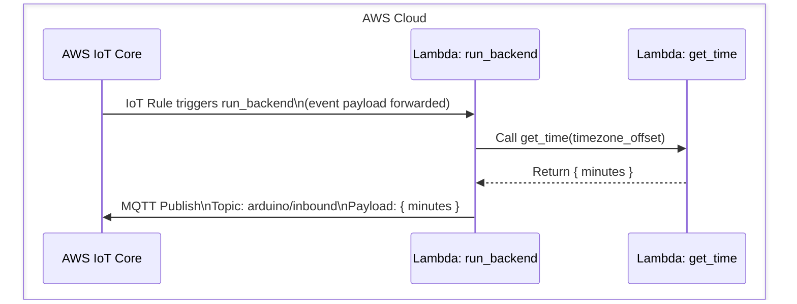
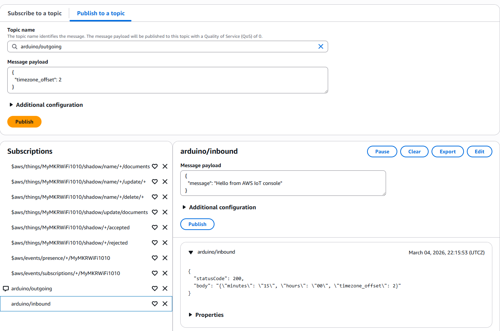
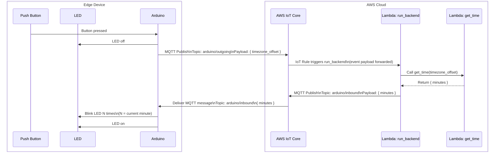

# Task 4 - Create a system backend using AWS Lambda triggered by AWS IoT Core

## 4.1 Create and test a cloud backend with AWS Lambda

In this section, we will implement and test the backend of our application, whose event logic is described in the diagram bellow.



### 4.1.1 - Create and test the lambda function `get_time`

1. Using the searchbar, open AWS Lambda.
2. Click on `Create function`:
    - Choose `Author from scratch`.
    - Name it `get_time`.
    - Choose the runtime `python 3.14`.
    - Choose the architecture `x86_64`.
    - Click on `Create function`.
3. In the `Code` tab, you should see a VSCode window with a `lambda_function.py` file containing placeholder code. Replace this code with the content of the file `lambdas/get_time/handler.py`. Click on `Deploy`.
4. In the `Test` tab, create a new event:
    - Select `Synchronous` invocation.
    - Name the event `gmt`.
    - Make the event `Sharable`.
    - In `Event JSON`, compy the contents of `lambdas/get_time/gmt.json`.
    - Click on `Test`, and if the excecution is successfull click on `Save`.
5. Create two more test events, one for GMT+2, and one for GMT-2.
6. Verify that the lambda function behaves as expected.

### 4.1.2 - Create and test the lambda function `run_backend`

1. In AWS Lambda, go to functions, and create a new function:
    - Choose `Author from scratch`.
    - Name it `run_backend`.
    - Choose the runtime `python 3.14`.
    - Choose the architecture `x86_64`.
    - In `Change default execution role`, click on `Use another role`, and click on `Create new role`.
2. In this new role, we will give this lambda function access to other lamba functions (to trigger `get_time`) and to AWS IoT core (to publish MQTT messages).
    - In additional policy, create a new policy, and paste the content of `infra/policies/run_backend.json`.
    - Click on `Create`.
    - Click on `Create function`.
3. In the MQTT test client, subscribe to the topic `arduino/inbound`.
4. Using the code in `lambdas/run_backend/handler.py`, deploy and test the function. Use the MQTT test client to verify it posts messages to the topic `arduino/inbound`.

### 4.1.3 - Create and test an AWS IoT rule to trigger `run_backend`

1. In AWS IoT, click on `Manage`->`Message routing`->`Rules`, and click on `Create rule`.
2. Name the rule `arduino_outgoing`.
3. Configure the SQL statement using `infra/iot_rules/arduino_outgoing.sql`.
4. In `Rule actions`, select `Lambda`, and choose `run_backend`. Click on `Next`, and `Create`.
5. In the MQTT test client:
    - Subscribe to `arduino/outgoing`.
    - Subscribe to `arduino/inbound`.
    - Publish on topic `arduino/outgoing` the following:
    ```json
    {
    "timezone_offset": 0
    }
    ```
6. Check that messages are posted on `arduino/inbound`.



## 4.2 - Update the firmware of the edge device to test the system end-to-end



This time, you're on your own! If you followed this tutorial step-by-step, you have all the skill and ressources to implement it without the need for solutions.

> [!TIP]
> If you'd like us to review your implementation, make a [pull request](https://docs.github.com/en/pull-requests/collaborating-with-pull-requests/proposing-changes-to-your-work-with-pull-requests/about-pull-requests) between your fork and the [project repository](https://github.com/David-GERARD/iot-button-system).
