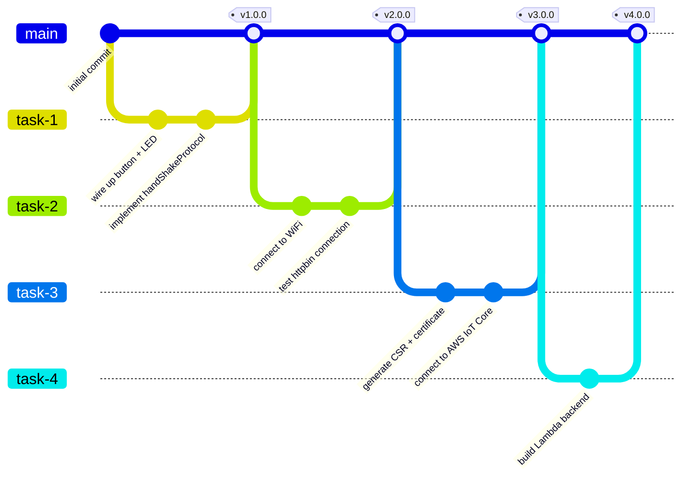

# Development Workflow

This is the development workflow you'll follow for the [Mini Project](home/mini-project.md): every task follows the same **branch → commit → pull request → tag** cycle. This page explains the workflow once, in full, so the step-by-step instructions repeated at the start and end of each task make sense in context.

## Why work this way?

Professional software teams rarely commit directly to their main branch. Instead, each piece of work happens on its own **branch**, is proposed as a **pull request**, gets **reviewed**, and is only merged once approved. In this tutorial, that review is done by one of the course educators — which is why you [added them as a collaborator](getting-started.md#3-add-a-course-educator-as-a-collaborator) on your fork. Tagging each merge also gives you a clean, versioned history of your progress: you can always go back and see exactly what your code looked like right after Task 2 was approved, for example.

## The cycle

For every task `N` (1 to 4):

1. **Branch** — create a branch named `task-N` from `main`, and check it out locally.
2. **Commit** — do the task's work, committing your progress to `task-N` as you go.
3. **Pull request** — push the branch, then open a pull request from `task-N` into `main` on GitHub.
4. **Review** — request a review from the course educator. Address any feedback with more commits to `task-N`; they'll show up in the same pull request automatically.
5. **Merge** — once approved, merge the pull request into `main`.
6. **Tag** — create a version tag (`vN.0.0`) on the resulting `main` commit, so this milestone is easy to find later.

Then the cycle repeats for the next task, branching off the updated `main`.

!!! tip
    The exact, click-by-click GitHub instructions for each step are given at the start (branch) and end (pull request, review, merge, tag) of every task page — you don't need to memorize this page, just come back to it if you want to understand *why* those steps exist.

Head to [Session 1](session1/content.md) to get started.

## Beyond the mini project

!!! note
    The mini project is scaled down for one person, but the workflow isn't a training-wheels exercise you shed afterwards. We recommend you use this same branch/commit/pull-request/tag approach — adapted to a team, with branches per feature and teammates reviewing each other's pull requests — for your final group project. Your development methodology is itself part of the assessment: you'll be expected to demonstrate how your team planned, reviewed, and versioned its work, not just show a finished system.
