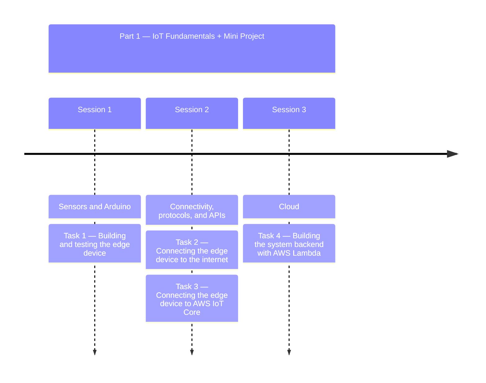
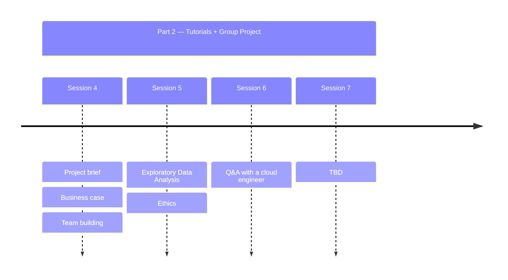

# Home

Welcome to the course website for **ELEC0033** and **ELEC0152**! 

---

## Course structure

### Part 1 — IoT fundamentals + Mini Project

An IoT crash course to get you familiar with all the tools and workflows you'll need to start working on the group project.

- **Session 1 — [Sensors and Arduino](../session1/content.md)**
- **Session 2 — [Connectivity, protocols, and APIs](../session2/content.md)**
- **Session 3 — [Cloud](../session3/content.md)**

Each of these three sessions is made up of a lecture followed by a guided tutorial, working through a [Mini Project](mini-project.md) one step at a time.

!!! note
    This mini project will serve as a **dress rehearsal** for the final group project ahead on which you will be evaluated. You will be working solo and on a small scale, learning the fundamentals of implementing an IoT system's backbone — edge device, connectivity, and cloud backend — as well as the tools and workflow (branches, pull requests, code review, version tags) you'll rely on to collaborate efficiently once you're building the Smart Supermarket system as a group.

### Part 2 — Tutorials + Group Project

Lectures covering additional material important to designing an IoT system, combined with dedicated time to work on your group project.

- **Session 4 — Project brief, Business case, Team building**
- **Session 5 — Exploratory Data Analysis, Ethics**
- **Session 6 — Q&A with a cloud engineer**
- **Session 7 — TBD**

More details on this part of the course, and the [Group Project](group-project.md) itself, will be added here in due course.

---

## Learning objectives

### IoT knowledge and skills

- Wire up and program sensors and actuators on a microcontroller.
- Understand and use connectivity protocols and APIs (WiFi, HTTP, MQTT, TLS/X.509).
- Build and connect a cloud backend (AWS IoT Core, AWS Lambda) that processes device data and responds to it.
- Understand the full edge → cloud → edge communication loop that underpins most real-world IoT systems.

### Engineering methodology and workflows

- Debug a multi-component system methodically, one layer of connectivity at a time.
- Use a professional, collaborative git workflow: feature branches, pull requests, code review, and version tags.
- Apply good security practices (secrets management, least-privilege IAM roles and policies).
- Structure and document a multi-component system clearly.

This course is built around **practical, hands-on skills**. The goal isn't to memorize IoT theory — it's to leave the course able to actually build, debug, and collaborate on a real IoT system, the same way you'll be expected to on the job.

---

## A note on AI use

!!! warning "AI is allowed — but you still have to know your system"
    You're welcome to use AI tools (Copilot, ChatGPT, Claude, and similar) while working through this course. However, assessment does not stop at "does it work". You will be asked to **describe your system**, **justify your design and methodology choices**, and **walk through your approach to troubleshooting** when something breaks.

    If you can't do this because you outsourced the thinking to an AI tool instead of understanding what you built, **you will fail that part of the assessment**. Use AI to move faster — not as a substitute for understanding your own system.
