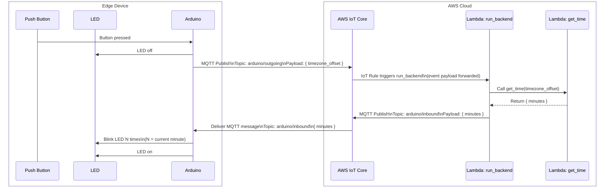

# 🔘 Mini Project — IoT Button System

This tutorial walks you through building a small end-to-end IoT system: a physical button connected to an Arduino board that communicates with a cloud backend hosted on Amazon Web Services.

By the end, you will have a working IoT pipeline from a physical button press to cloud-side logic and back.



## 🎯 Main objectives — build the backbone of an IoT cloud system

* Build a complete system using an **Arduino**, MQTT, AWS IoT Core, and AWS Lambda.
* Publish and subscribe to MQTT topics (`arduino/outgoing`, `arduino/inbound`).
* Trigger a Lambda function from an IoT rule and process cloud-side logic.
* Send data back to the device and translate it into a physical action (LED blinking).
* Understand the full edge → cloud → edge communication loop.

These are exactly the building blocks — an edge device, connectivity, and a cloud backend — that the Smart Supermarket IoT system will be built on, just at group scale.

## 🤝 Secondary objectives — tools and workflow for collaborative programming

* Practice the collaborative git workflow you'll rely on as a group: feature branches, pull requests, code review, and version tags (see [Development Workflow](../development-workflow.md)).
* Version the project using Git and GitHub.
* Develop embedded firmware using PlatformIO and Visual Studio Code instead of the Arduino IDE.
* Apply good security practices (secrets files, IAM users and roles, secure MQTT policies).
* Structure a multi-component system clearly.

## 🗺️ Structure of the tutorial

!!! warning
    IoT systems mix hardware, firmware, networking, and cloud infrastructure. When something does not work, the issue could be anywhere. If you connect everything at once, debugging quickly becomes painful.

Thus, this tutorial follows a strict order:

1. Make the hardware work.
2. Make the device talk to your computer.
3. Make it connect to the Internet.
4. Make it talk to AWS.
5. Add backend logic in the cloud.

Take the tasks in order. Do not move on until the current step behaves exactly as expected. That discipline is what makes larger systems manageable.

## 📚 Mini project structure

The mini project is split over three sessions. Each session has a **Lecture Notes** page covering the background you need, followed by one or more hands-on **Task** pages.

| Session | Lecture Notes | Tasks |
|---------|---------------|-------|
| [Session 1](../session1/content.md) | Embedded systems, firmware, and PlatformIO | [Task 1 — Building and testing the edge device](../session1/task1.md) |
| [Session 2](../session2/content.md) | Networking, MQTT, and AWS IoT Core | [Task 2 — Connecting the edge device to the internet](../session2/task2.md), [Task 3 — Connecting the edge device to AWS IoT Core](../session2/task3.md) |
| [Session 3](../session3/content.md) | Serverless backends with AWS Lambda | [Task 4 — Building the system backend with AWS Lambda](../session3/task4.md) |

Before you start, follow the [Getting Started](../getting-started.md) guide to set up your tools and clone the project.

## 📁 Repository structure

```text
iot-button-system/
├── docs/     # Source for this documentation site
├── firmware/ # Arduino firmware for the MKR WiFi 1010 board
├── infra/    # AWS IoT Core config files (policies, rules)
└── lambdas/  # AWS Lambda function code, written in Python
```

## 🧰 Hardware requirements

- Arduino MKR WiFi 1010.
- MKR Connector Carrier.
- LED kit.
- Push button kit.
