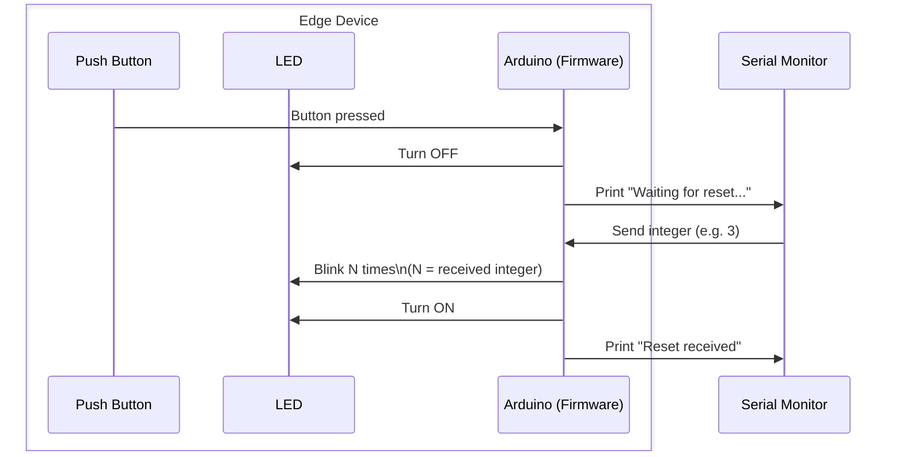

# 🔧 Mini Project Task 1 — Building and Testing the Edge Device

!!! note
    Before starting, make sure you have completed the [Getting Started](../getting-started.md) guide (IDE setup, forking, cloning, adding a course educator as a collaborator, and opening `firmware/` in PlatformIO).

## 1.0 — 🌿 Create a branch for this task

1. On GitHub, in **your fork**, go to the branches page and click `New branch`. Name it `task-1`, create it from `main`, and click `Create new branch`.
2. Open your cloned repository in VSCode.
3. In a terminal, run `git fetch` to make VSCode aware of the new branch.
4. Check out the new branch:
    ```bash
    git checkout task-1
    ```
5. On GitHub, in **your fork**, click on `Pull requests` → `New pull request`. Set `base: main` and `compare: task-1`. The description box will be pre-filled from the [pull request template](https://github.com/David-GERARD/iot-button-system/blob/main/.github/PULL_REQUEST_TEMPLATE.md) — skim it now, you'll fill it in as you go.
6. Click the dropdown arrow on the `Create pull request` button and choose `Create draft pull request` instead.

All the work for this task should be committed to the `task-1` branch.

### What to put in the pull request description

- **Title:** `Task 1 — Building and testing the edge device`
- **Feature purpose:** Build the edge device's core sense/actuate loop — read the push button, drive the LED — and verify it with a simple serial "reset" handshake, the same pattern every later task will reuse with a different reset trigger.
- **Feature architecture:** An Arduino MKR WiFi 1010 wired to a push button (pin D2, input) and an LED (pin D3, output). `loop()` polls the button; once pressed, `handShakeProtocol()` blocks until it receives a reset signal — here, an integer typed into the Serial Monitor — then blinks the LED that many times before turning it back on.
- **Feature interfaces:** Digital I/O pins D2 (button) and D3 (LED); the Serial Monitor over USB, standing in for the network/cloud acknowledgement used in later tasks.
- **Test plan:** Manual hardware test — confirm the LED is on by default, turns off on button press, and blinks N times then turns back on when N is entered in the Serial Monitor (see 1.3).
- **Implementation roadmap:** e.g. wire the hardware → implement `handShakeProtocol()` → build & upload → manually verify against 1.3.

!!! note
    For this mini project, we're giving you this breakdown to get you familiar with what "planning a feature" looks like before you touch any code. For your group project, nobody will hand you this plan — working out the purpose, architecture, interfaces, and test plan for each feature *is* part of the planning work you'll be doing yourselves.

## 1.1 — 🔨 Building the edge device

1. Connect the Arduino MKR WiFi 1010 to the MKR Connector Carrier.
2. Connect the LED module to port D3 of the MKR Connector Carrier.
3. Connect the Push Button module to port D2 of the MKR Connector Carrier.

!!! warning
    Make sure to correctly orient the connectors.
    

## 1.2 — ⬆️ Write and upload the firmware to the edge device

Event logic implemented in task 1:



1. In VSCode, click on the Explorer tab, and double click on the file `firmware/src/main.cpp` to open it.
2. Read the code, and familiarise yourself with how it implements the event logic illustrated above.
3. In `main.cpp`, implement the function `handShakeProtocol()` so that when triggered:
    - It waits for an integer from the Serial monitor.
    - When received, it runs the function `ledBlinkPatern` using the integer as its argument.
    - When `ledBlinkPatern` is done running, it sets `resetReceived` to 0 and it turns the LED back on.
4. In the PlatformIO tab, in `general`, click on `Build`. Check the terminal for errors.
5. In the PlatformIO tab, in `general`, click on `Upload and Monitor`.

## 1.3 — ✅ Test the edge device

Verify the following:

1. By default, the LED is on.
2. When pressing the button, the LED turns off and stays off.
3. When entering an integer in the serial monitor, the LED blinks (3 times if you entered 3...), and then turns back on.

## 1.4 — 🔀 Submit the task for review

1. Commit and push your changes to the `task-1` branch — they show up automatically in your draft pull request.
2. Finish filling in the pull request description from the template (purpose, architecture, interfaces, test plan, roadmap).
3. On the pull request page, click `Ready for review` to take it out of draft.
4. Request a review from the course educator you added as a collaborator in [Getting Started](../getting-started.md#3-add-a-course-educator-as-a-collaborator) (click the gear icon next to `Reviewers`).
5. Once the pull request is approved, click `Merge pull request` → `Confirm merge`.
6. On GitHub, in **your fork**, click on `Releases` (in the right sidebar of the repository home page) → `Create a new release`. Click `Choose a tag`, type `v1.0.0`, and click `Create new tag: v1.0.0 on publish`. Make sure `Target` is set to `main`, then click `Publish release`.

## 💡 Solutions for Task 1

`firmware/src/main.cpp`:

```c++
#include <Arduino.h>


// Pin definitions
const int buttonPin = 2;     // the number of the pushbutton pin
const int ledPin =  3;      // the number of the LED pin

// Status variables
int buttonState = 0;         // variable for reading the pushbutton status
int resetReceived = 0;       // variable for reading the reset status


// Function prototypes
void ledBlinkPatern(int pattern);
void handShakeProtocol();


// The setup function runs once when you press reset or power the board
void setup() {
    // initialize serial communication.
    Serial.begin(9600);
    // initialize the LED pin as an output.
    pinMode(ledPin, OUTPUT);
    // initialize the pushbutton pin as an input.
    pinMode(buttonPin, INPUT);
    // make sure the LED is on at the start
    digitalWrite(ledPin, HIGH);

}

// The loop function runs over and over again forever
void loop() {

    buttonState = digitalRead(buttonPin);

    if (buttonState == HIGH && resetReceived == 0) {
        Serial.println("Button pressed, waiting for reset...");
        resetReceived = 1;
        digitalWrite(ledPin, LOW);
    }

    if (resetReceived == 1) {
        handShakeProtocol();
        delay(1000); // Add a delay to prevent the loop from running too fast after the handshake protocol is complete
    }


}


void ledBlinkPatern(int pattern) {
    /*************************************************************
    * This function is used to show the status of the LED.
    *
    * The pattern indicates how many times the LED will blink.
    * For example, if the pattern is 3, the LED will blink 3 times.
    **************************************************************/
    Serial.print("Status received:");
    Serial.println(pattern);
    for (int i = 0; i < pattern; i++) {
        digitalWrite(ledPin, HIGH);
        delay(500);
        digitalWrite(ledPin, LOW);
        delay(500);
    }
}

void handShakeProtocol() {
    /*************************************************************
    * This function is used to implement the handshake protocol between pressing the button and the reset of the LED.
    *
    * When the button is pressed, the LED will turn on and stay on until the reset is received.
    * Once the reset is received, the LED will turn off and the system will be ready for the next button press.
    * In task 1, the reset is triggered by waiting for an integer pattern to be sent through the serial monitor.
    * In task 2, the reset is triggered by connecting to an external server to check that the device is connected to the internet.
    * In task 3, the reset is triggered by waiting for an MQTT message that aknowledges that the device is connected to the MQTT broker.
    * In task 4, the reset is triggered by waiting for an MQTT message that sends a specific command to the device based on administrative rules defined in the cloud.
    **************************************************************/

    // TODO: YOUR CODE HERE
    if (Serial.available() > 0) {
        int pattern = Serial.parseInt(); // read the pattern from the serial monitor
        ledBlinkPatern(pattern); // blink the LED according to the received pattern

        resetReceived = 0; // reset the reset status
        digitalWrite(ledPin, HIGH);
        Serial.println("Reset received, LED is ON, waiting for button press...");
    }
}
```
