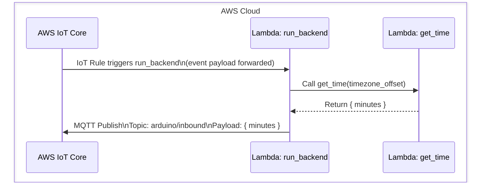
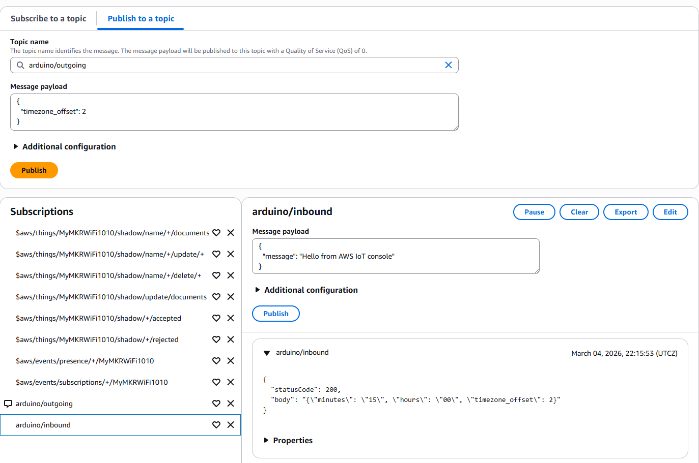
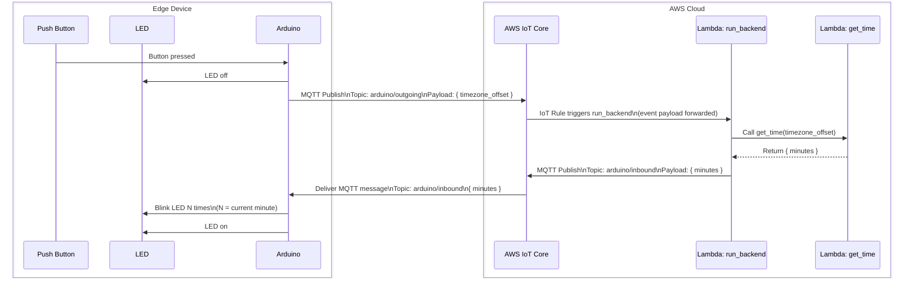

# ⚡ Mini Project Task 4 — Create a System Backend Using AWS Lambda Triggered by AWS IoT Core

## 4.0 — 🌿 Create a branch for this task

1. On GitHub, in **your fork**, go to the branches page and click `New branch`. Name it `task-4`, create it from `main`, and click `Create new branch`.
2. Open your cloned repository in VSCode.
3. In a terminal, run `git fetch` to make VSCode aware of the new branch.
4. Check out the new branch:
    ```bash
    git checkout task-4
    ```
5. On GitHub, in **your fork**, click on `Pull requests` → `New pull request`. Set `base: main` and `compare: task-4`. The description box will be pre-filled from the [pull request template](https://github.com/David-GERARD/iot-button-system/blob/main/.github/PULL_REQUEST_TEMPLATE.md) — skim it now, you'll fill it in as you go.
6. Click the dropdown arrow on the `Create pull request` button and choose `Create draft pull request` instead.

All the work for this task should be committed to the `task-4` branch.

### What to put in the pull request description

- **Title:** `Task 4 — Create a system backend using AWS Lambda triggered by AWS IoT Core`
- **Feature purpose:** Close the loop — add the cloud-side logic that reacts to the device's message and sends back something meaningful, completing the edge → cloud → edge pipeline.
- **Feature architecture:** An IoT Rule on `arduino/outgoing` triggers the `run_backend` Lambda, which calls the `get_time` Lambda and publishes the result to `arduino/inbound`; the edge device subscribes to `arduino/inbound` and blinks the LED accordingly.
- **Feature interfaces:** Lambda-to-Lambda invocation (`run_backend` → `get_time`); the IAM role/policy scoping `run_backend`'s permissions; the MQTT topics `arduino/outgoing` (in) and `arduino/inbound` (out).
- **Test plan:** MQTT test client publishing test payloads to `arduino/outgoing` and checking `arduino/inbound` (see 4.1.3); then an end-to-end test by pressing the physical button (see 4.2).
- **Implementation roadmap:** e.g. deploy & test `get_time` → deploy & test `run_backend` with its IAM role → create the IoT rule → update the firmware to subscribe/publish and blink → verify end-to-end.

!!! note
    As with the earlier tasks, this breakdown is scaffolding to show you what feature planning looks like — but this time you're implementing it without a step-by-step solution, which is the closest this mini project gets to the group project. There, nobody hands you the purpose, architecture, interfaces, and test plan up front: working those out yourselves *is* the planning work.

## 4.1 — ⚡ Create and test a cloud backend with AWS Lambda

In this section, we will implement and test the backend of our application, whose event logic is described in the diagram below.



### 4.1.1 — 🕐 Create and test the Lambda function `get_time`

1. Using the search bar, open AWS Lambda.
2. Click on `Create function`:
    - Choose `Author from scratch`.
    - Name it `get_time`.
    - Choose the runtime `Python 3.14`.
    - Choose the architecture `x86_64`.
    - Click on `Create function`.
3. In the `Code` tab, you should see a VSCode-like window with a `lambda_function.py` file containing placeholder code. Replace this code with the content of the file `lambdas/get_time/handler.py`. Click on `Deploy`.
4. In the `Test` tab, create a new event:
    - Select `Synchronous` invocation.
    - Name the event `gmt`.
    - Make the event `Sharable`.
    - In `Event JSON`, copy the contents of `lambdas/get_time/gmt.json`.
    - Click on `Test`, and if the execution is successful, click on `Save`.
5. Create two more test events, one for GMT+2, and one for GMT-2.
6. Verify that the Lambda function behaves as expected.

### 4.1.2 — ⚙️ Create and test the Lambda function `run_backend`

1. In AWS Lambda, go to functions, and create a new function:
    - Choose `Author from scratch`.
    - Name it `run_backend`.
    - Choose the runtime `Python 3.14`.
    - Choose the architecture `x86_64`.
    - In `Change default execution role`, click on `Use an existing role` → actually click `Use another role`, and click on `Create new role`.
2. In this new role, we will give this Lambda function access to other Lambda functions (to trigger `get_time`) and to AWS IoT Core (to publish MQTT messages).
    - In additional policy, create a new policy, and paste the content of `infra/policies/run_backend.json`.
    - Click on `Create`.
    - Click on `Create function`.
3. In the MQTT test client, subscribe to the topic `arduino/inbound`.
4. Using the code in `lambdas/run_backend/handler.py`, deploy and test the function. Use the MQTT test client to verify it posts messages to the topic `arduino/inbound`.

### 4.1.3 — 🔗 Create and test an AWS IoT rule to trigger `run_backend`

1. In AWS IoT, click on `Manage` → `Message routing` → `Rules`, and click on `Create rule`.
2. Name the rule `arduino_outgoing`.
3. Configure the SQL statement using `infra/iot_rules/arduino_outgoing.sql`.
4. In `Rule actions`, select `Lambda`, and choose `run_backend`. Click on `Next`, and `Create`.
5. In the MQTT test client:
    - Subscribe to `arduino/outgoing`.
    - Subscribe to `arduino/inbound`.
    - Publish on topic `arduino/outgoing` the following:

    ```json
    {
    "timezone_offset": 0
    }
    ```

6. Check that messages are posted on `arduino/inbound`.
    

## 4.2 — 🔄 Update the firmware of the edge device to test the system end-to-end



This time, you're on your own! If you followed this tutorial step-by-step, you have all the skills and resources needed to implement it without solutions.

## 4.3 — 🔀 Submit the task for review

1. Commit and push your changes to the `task-4` branch — they show up automatically in your draft pull request.
2. Finish filling in the pull request description from the template (purpose, architecture, interfaces, test plan, roadmap).
3. On the pull request page, click `Ready for review` to take it out of draft.
4. Request a review from the course educator you added as a collaborator in [Getting Started](../getting-started.md#3-add-a-course-educator-as-a-collaborator) (click the gear icon next to `Reviewers`).
5. Once the pull request is approved, click `Merge pull request` → `Confirm merge`.
6. On GitHub, in **your fork**, click on `Releases` (in the right sidebar of the repository home page) → `Create a new release`. Click `Choose a tag`, type `v4.0.0`, and click `Create new tag: v4.0.0 on publish`. Make sure `Target` is set to `main`, then click `Publish release`.

Congratulations — you've built the complete end-to-end system!
